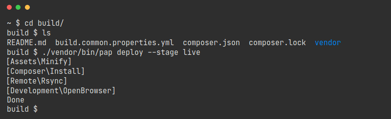

# PAP


**P**HP **A**pp **P**ublication

[](https://packagist.org/packages/pixelbrackets/pap/)
[](https://gitlab.com/pixelbrackets/pap/pipelines)
[](https://gitlab.com/pixelbrackets/pap#requirements)
[](https://spdx.org/licenses/GPL-2.0-or-later.html)
[](https://gitlab.com/pixelbrackets/pap/-/blob/master/CONTRIBUTING.md)

Toolchain to publish a PHP App. Configured with a YAML file only.

🚀

- Build Assets - Minify & concat CSS, JavaScript, SVG assets
- Build App - Prepare expected directory structures & fetch packages
- Lint - Identify errors before the app is running
- Deploy - Sync files to configurable target stages
- Verify - Do a smoke test to verify that the app is still working
- Test - Start integration tests

🔧

- All general settings and shared stages are configured in a YAML file

🎯

- KISS - Not made for every condition, but easy to use and integrate



## Vision

- One CLI script with a fixed set of task commands
  - No mix, extending or renaming of task commands
  - Tasks not configured will abort instead of failing
- Configuration with a flat text file
- Override settings for local machines
- Installation reduced to a bare minimum
- Portable, easy to integrate in many repositories
- Useable by a person who never deployed the app before
  - No additional knowledge required
  - One command is enough to deploy the app to a stage
- Always the same commands, don't care about the configuration set up
- Works well with robots (CI)
- Minimal requirements on target stage
- Rsync to synchronize files - no FTP
- SSH to connect to stages
- No rollback - Use Git to revert changes
- No provisioning
- Support for monorepos
- Deploy to many stages

General approach: Not made for every condition, but easy to use and integrate

## Requirements

- cURL, SSH & rsync
- Git
- PHP
- Composer
- SSH-Account on target stage(s) with read & write access,
  and right to run cURL, rsync and PHP

## Installation

Packagist Entry https://packagist.org/packages/pixelbrackets/pap/

- `composer require pixelbrackets/pap`

💡 Use the
[skeleton project](https://packagist.org/packages/pixelbrackets/pap-skeleton/)
to create a `build` directory and add required configuration files right away.

```bash
composer create-project pixelbrackets/pap-skeleton build
```

Read the [integration guide](#integration) to learn how to add the tool to
your own app.

## Source

https://gitlab.com/pixelbrackets/pap/

Mirror https://github.com/pixelbrackets/pap/ (Issues & Pull Requests
mirrored to GitLab)

## Usage

Run `./vendor/bin/pap` to see all available tasks. Some common tasks are:

1. Deploy to »live« stage
   ```bash
   ./vendor/bin/pap deploy --stage live
   ```

1. Deploy to »local« stage, used for development (default stage)
   ```bash
   ./vendor/bin/pap deploy
   ```

1. Sync to »local« stage (skips building assets)
   ```bash
   ./vendor/bin/pap sync
   ```

1. Sync to »local« stage automatically if anything changes in the
   source directory (files changed, added or removed)
   ```bash
   ./vendor/bin/pap watch
   ```

1. Lint current build
   ```bash
   ./vendor/bin/pap lint
   ```

### Commands

<!-- Generate using `./bin/pap list` and sort alphabetically -->

```
build             Alias to run »buildassets« and »buildapp«
buildapp          Build PHP structure for desired target stage (move files, fetch dependencies)
buildassets       Build HTML assets (convert, concat, minify…)
composer:command  Execute Composer commands on target stage
composer:install  Install packages with Composer
deploy            Run full deployment stack (build, sync, composer command)
help              Displays help for a command
lint              Alias to run »lint:check«
lint:check        Lint files (Check only)
lint:fix          Lint files (Fix)
list              Lists commands
publish           Run full publication stack (lint, deploy, smoketest, test)
smoketest         Run a build verification test against target stage
ssh:connect       Open SSH connection to target stage
sync              Synchronize files to target stage
test              Run tests suite against target stage
view              Open the public URL of target stage in the browser
watch             Sync changed files automatically to local stage
```

## Integration

- [Install PAP](#installation), either as dependency or in a designated
  subfolder
  - Best practice is to create a separate directory for the build & deploy 
    process, this is not mandatory however
- Add the PAP [configuration](#configuration) file
  `build.common.properties.yml` for all shared settings
- Add `build.local.properties.yml` to your `.gitignore` file
- Add `.lock` to your `.gitignore` file
- Optional but recommended: Add a template file to overwrite local settings,
  eg. `build.local.properties.template.yml`
- Add a README how to use PAP

💡 There is a
[skeleton project](https://packagist.org/packages/pixelbrackets/pap-skeleton/)
available to create a build directory and add the above mentioned files.

```bash
composer create-project pixelbrackets/pap-skeleton build
```

## Configuration

- All general settings and shared stages are configured in
  the distribution file `build.common.properties.yml`
- All settings and stages may be overriden in a local environment file
  `build.local.properties.yml`
  - This file should be added to the `.gitignore` list
- PAP always uses the root directory of the Git repository for all configurable
  paths, which allows storing the configuration file in any subdirectory
- 📝 Documentation of all [available options](./docs/configuration.md)

💡 Additionally to this short integration and configuration guide you may
want to take a look at the [walktrough tutorial](./docs/walktrough.md),
which explains all steps to configure an example app.

## Updates

See [Upgrade Guide](./docs/upgrade-guide.md)

## License

GNU General Public License version 2 or later

The GNU General Public License can be found at http://www.gnu.org/copyleft/gpl.html.

## Author

Dan Untenzu (<mail@pixelbrackets.de> / [@pixelbrackets](https://pixelbrackets.de))

## Changelog

See [CHANGELOG.md](./CHANGELOG.md)

## Contribution

This script is Open Source, so please use, share, patch, extend or fork it.

[Contributions](./CONTRIBUTING.md) are welcome!

## Feedback

Please send some [feedback](https://pixelbrackets.de/) and share how this
package has proven useful to you or how you may help to improve it.
