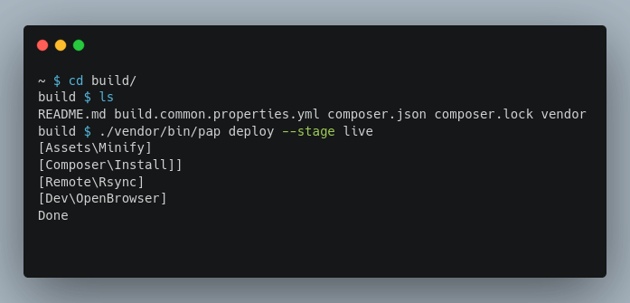

# PAP


**P**HP **A**pp **P**ublication

[](https://packagist.org/packages/pixelbrackets/pap/)
[](https://gitlab.com/pixelbrackets/pap/pipelines)
[](https://gitlab.com/pixelbrackets/pap#requirements)
[](https://spdx.org/licenses/GPL-2.0-or-later.html)
[](https://gitlab.com/pixelbrackets/pap/-/blob/master/CONTRIBUTING.md)

Toolchain to publish a PHP App. Configured with a YAML file only.

🚀

- Build Assets - Minify & concat CSS, JavaScript, SVG assets
- Build App - Prepare expected directory structures & fetch packages
- Lint - Identify errors before the app is running
- Deploy - Sync files to configurable target stages
- View - Do a smoke test to verify that the app is still working
- Test - Start integration tests

🔧

- All general settings and shared stages are configured in a YAML file

🎯

- KISS - Not made for every condition, but easy to use and integrate



## Vision

- One CLI script with a fixed set of task commands
  - No mix, extending or renaming of task commands
  - Tasks not configured will abort instead of failing
- Configuration with a flat text file
- Override settings for local machines
- Installation reduced to a bare minimum
- Portable, easy to integrate in many repositories
- Useable by a person who never deployed the app before
  - No additional knowledge required
  - One command is enough to deploy the app to a stage
- Works well with robots (CI)
- Minimal requirements on target stage
- Rsync to synchronize files - no FTP
- SSH to connect to stages
- No rollback - Use Git to revert changes
- No provisioning
- Support for monorepos
- Deploy to many stages

General approach: Not made for every condition, but easy to use and integrate

## Requirements

- cURL, SSH & rsync
- Git
- PHP
- Composer
- SSH-Account on target stage(s)

## Installation

Packagist Entry https://packagist.org/packages/pixelbrackets/pap/

Read the [integration guide](#integration) to learn how to add the tool to
your own app.

## Source

https://gitlab.com/pixelbrackets/pap/

https://github.com/pixelbrackets/pap/

## Usage

Run `./vendor/bin/pap` to see all available tasks. Some common tasks are:

1. Deploy to »live« stage
   ```bash
   ./vendor/bin/pap deploy --stage live
   ```

1. Deploy to »local« stage, used for development (default stage)
   ```bash
   ./vendor/bin/pap deploy
   ```

1. Sync to »local« stage (skips building assets)
   ```bash
   ./vendor/bin/pap sync
   ```

1. Sync to »local« stage automatically if anything changes in the
   source directory (files changed, added or removed)
   ```bash
   ./vendor/bin/pap watch
   ```

1. Lint current build
   ```bash
   ./vendor/bin/pap lint
   ```

## Integration

- Best practice is to create a separate directory for the build & deploy 
  process, this is not mandatory however
- Add PAP as dependency
- Add the PAP [configuration](#configuration) file
  `build.common.properties.yml` for all shared settings
- Add `build.local.properties.yml` to your `.gitignore` file
- Add `.lock` to your `.gitignore` file
- Optional but recommended: Add a template file to overwrite local settings,
  eg. `build.local.properties.template.yml`
- Add a README how to use PAP

💡 There is a
[skeleton project](https://packagist.org/packages/pixelbrackets/pap-skeleton/)
available to create a build directory and add the abovementioned files.

```bash
composer create-project pixelbrackets/pap-skeleton build
```

## Configuration

- All general settings and shared stages are configured in
  the distribution file `build.common.properties.yml`
- All settings and stages may be overriden in a local environment file
  `build.local.properties.yml`
  - This file should be added to the `.gitignore` list
- PAP always uses the root directory of the Git repository for all configurable
  paths, which allows storing the configuration file in any subdirectory
- 📝 Documentation of all [available options](./docs/configuration.md)

## Updates

See [Upgrade Guide](./docs/upgrade-guide.md)

## License

GNU General Public License version 2 or later

The GNU General Public License can be found at http://www.gnu.org/copyleft/gpl.html.

## Author

Dan Untenzu (<mail@pixelbrackets.de> / [@pixelbrackets](https://pixelbrackets.de))

## Changelog

See [./CHANGELOG.md](CHANGELOG.md)

## Contribution

This script is Open Source, so please use, patch, extend or fork it.

[Contributions](CONTRIBUTING.md) are welcome!
